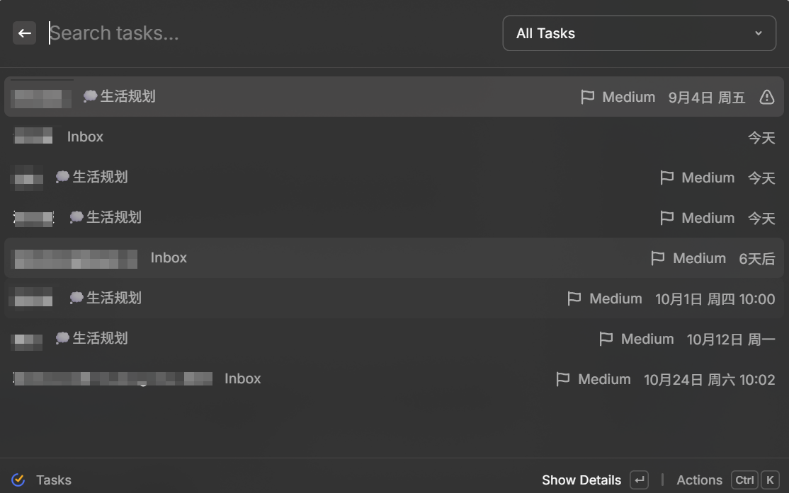

# Dida 365 for Raycast

Raycast extension for Dida365/TickTick, built strictly on the public Open API documented at <https://developer.dida365.com/docs#/openapi> (TickTick: <https://developer.ticktick.com/docs#/openapi>). No private endpoints.



## Setup

1. Token: dida365.com web app → avatar → 设置 → 账号 → API Token (TickTick: Settings → Account → API Token).
2. `npm install`
3. Raycast extension preferences: API Token (required), default timezone (dropdown, defaults to system), API region (China = api.dida365.com, International = api.ticktick.com — both official, default China), and Inbox Project ID. The public `/project` endpoint does not return Inbox, so its account-specific projectId (currently `inbox1015263871`) is used to load Inbox tasks through `GET /project/{projectId}/data`.

## API coverage — 11 / 11 public endpoints

All paths below are under `https://api.dida365.com/open/v1`:

| Endpoint | Wrapper |
|---|---|
| GET /project (offset/limit, max 200) | getProjects() |
| GET /project/{projectId} | getProject() |
| GET /project/{projectId}/data | getProjectData() |
| POST /project | createProject() |
| POST /project/{projectId} | updateProject() |
| DELETE /project/{projectId} | deleteProject() |
| GET /project/{projectId}/task/{taskId} | getTask() |
| POST /task | createTask() |
| POST /task/{taskId} | updateTask() |
| POST /project/{projectId}/task/{taskId}/complete | completeTask() |
| DELETE /project/{projectId}/task/{taskId} | deleteTask() |

validateToken() (GET /project) covers token checks. Auth: `Authorization: Bearer <token>`.

POST /task/{taskId} doubles as the reopen path: the public spec ships no uncomplete endpoint, so uncompleteTask() writes status 0. Task notes are stored in `content`; `desc` is cleared on write because the form merges both fields into Notes.

## Public V2 batch endpoints (verified against the same spec)

- POST /task/completeTasks → completeTasks(): ≤50 ids, one project, returns ids.
- POST /task/move → moveTasks(): cross-project move, returns {id, etag} list.
- POST /task/batch → batchTasks(): ≤50 adds + ≤50 updates, returns id2etag/id2error.
- POST /task/completed → getCompletedTasks(): ≤200 completed tasks in a time range.

There is no public batch-delete endpoint; batch delete loops the required
single-task DELETE. Statistics read from /task/completed and are capped at the
API's 200-record limit.

## Commands

Tasks (browse/filter/search/batch, a Completed view, uncomplete/reopen, with token validation under Actions → Settings), Today Tasks, Quick Add Task (natural language, launch argument), Create Task, Projects, Create Project, Clipboard to Task, Task Templates, Statistics, Menu Bar.

## Quick Add markers

Default markers: #project, !priority, @date, ~repeat. Each can be changed in
extension preferences (Quick Add Project/Priority/Date/Repeat Marker).

## Quick Add syntax

One line = one task. Markers are stripped from the title.

| Marker | Examples | Meaning |
|---|---|---|
| `#` | `#工作` | project, matched by name |
| `!` | `!high` `!h` `!高`, `!medium` `!m` `!中`, `!low` `!l` `!低` | priority |
| `@` | `@明天`, `@2026-03-20`, `@2026-03-20T14:30`, `@15:30`, `@下周一` | due date, with an optional time |
| `~` | `~每天`, `~工作日`, `~每周一、三`, `~每2天`, `~每2周`, `~每月`, `~每2月`, `~每月15日`, `~每年`, `~每年3月15日` | repeat |

The `~` token takes a weekday list (`每周一、三、五`), a calendar day
(`每月15日`), or a month and day (`每年3月15日`). Interval plus a specific day,
such as `每2周的周一`, has no quick-add form; write it in the form's custom
`RRULE:` field instead.

Chinese date phrases work without a marker: `明天下午3点开会`, `两小时后`, `月底前`, `3月15日`.

Reminders use the date marker with a `remind` prefix: `@remind提前30分钟`,
`@remind2小时`, `@remind准时`. A reminder is an offset from the due date, so it
needs one.

## Form fields

- Due Date takes a date and, unless All day is ticked, a time.
- Repeat offers presets plus 每周指定星期, 每月指定日期, 每 N 天/周/月/年, and a raw
  `RRULE:` field. Raw rules use iCalendar syntax, for example
  `RRULE:FREQ=WEEKLY;BYDAY=MO,FR`, `RRULE:FREQ=MONTHLY;BYMONTHDAY=15`,
  `RRULE:FREQ=DAILY;INTERVAL=3`.
- Reminders are presets plus a custom amount with a 分钟/小时/天 unit.

## Local-only features (no official API support; implemented locally)

- Quick Add natural-language parsing (dates, project/priority shorthand, recurrence phrases): local rules, no AI, no chrono-node dependency.
- Templates, favorite filters, recent projects and recent tasks, menu-bar counts, statistics aggregation: LocalStorage + public data.
- 429 handling: the official spec documents no rate limits; the client handles 429 defensively (honors Retry-After when present). Undocumented behavior.
- Completion statistics proxy: live aggregate uses dueDate as a proxy (API /data returns undone tasks only); historical completed counts use public POST /task/completed where called.

## Verify

```
npm install
npm test
npm run lint
npm run build
```

## License

MIT © 2026 Daniel
